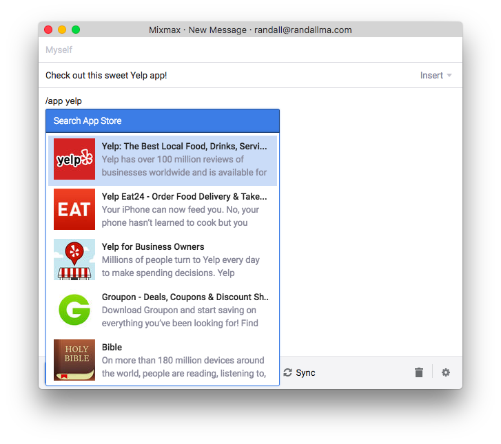
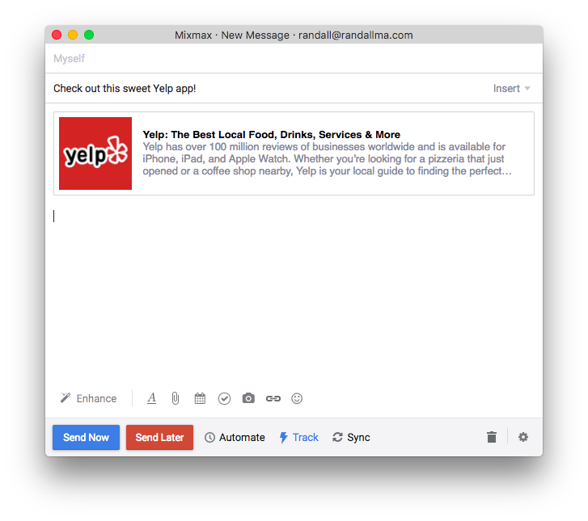

# App Store Slash Command for Mixmax

This is an open source Mixmax Slash Command. See <http://developer.mixmax.com/docs/overview-slash-commands#tutorial-building-mygiphy> for more information about how to use this example code in Mixmax. Forked from https://github.com/mixmaxhq/giphy-example-slash-command as a starting point for playing around with the Mixmax Integrations API.

## Screenshots




## Running locally

1. Install using `npm install`
2. Run using `npm start`

To simulate locally how Mixmax calls the typeahead URL (to return a JSON list of typeahead results), run:

```
curl http://localhost:9145/typeahead?text=cats
```

To simulate locally how Mixmax calls the resolver URL (to return HTML that goes into the email), run:

```
curl http://localhost:9145/resolver?text=cats
```
